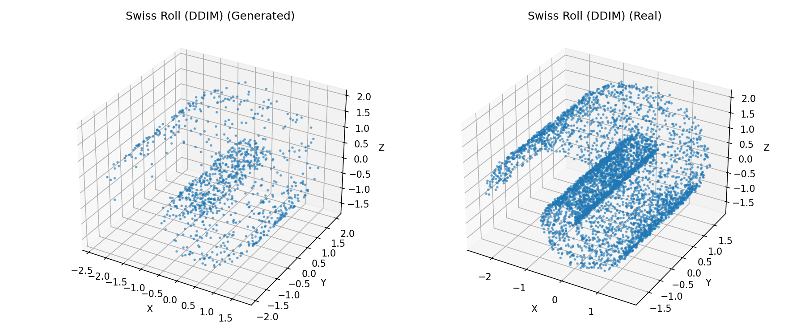
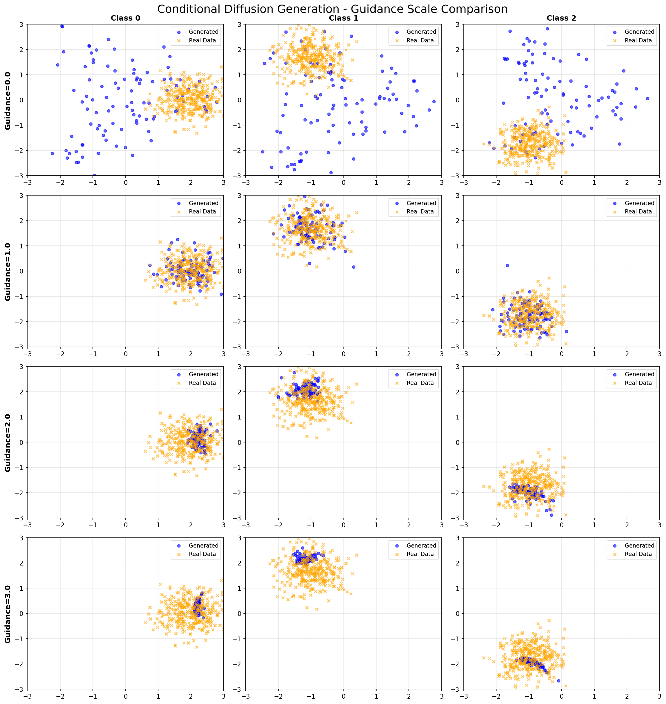

# Diffusion Model Toy Implementation

[](https://www.python.org/)
[](https://pytorch.org/)
[](LICENSE)

A clean, modular, and educational implementation of Diffusion Models for generating toy datasets. Perfect for learning and experimenting with diffusion models!

> **🚀 Coming Soon**: JAX implementation is under development and will be added in future updates!

## ✨ Features

- **🧩 Modular Design**: Clean, plug-and-play components for easy experimentation
- **⚡ Multiple Sampling Methods**: DDPM (standard) and DDIM (accelerated) samplers
- **🎯 Classifier-Free Guidance**: Full support for conditional generation with CFG
- **🏗️ Flexible Architecture**: Configurable UNet model for various data dimensions
- **📚 Educational**: Well-documented code with clear examples
- **🎨 Visualization Tools**: Built-in 2D and 3D visualization functions
- **✅ Bug-Free CFG**: Recently fixed critical bugs in Classifier-Free Guidance implementation

## 📊 Example Results

The implementation supports various toy datasets and conditional generation:

- **Swiss Roll Dataset**: 3D spiral structure generation
- **Conditional Generation**: Multi-class Gaussian distributions with guidance control
- **Guidance Scale Comparison**: Visualize the effect of different guidance strengths

<p align="center">
  
</p>

<p align="center">

</p>
## 📁 Project Structure

```
Jax-DiffusionModel-Toy-main/
├── src/
│   ├── data/
│   │   ├── __init__.py
│   │   └── toy_datasets.py          # Swiss Roll, Gaussian, Sinusoid datasets
│   ├── diffusion/
│   │   ├── __init__.py
│   │   └── diffusion.py             # Gaussian diffusion process
│   ├── models/
│   │   ├── __init__.py
│   │   ├── embeddings.py            # Time and condition embeddings
│   │   └── unet.py                  # UNet architecture
│   ├── samplers/
│   │   ├── __init__.py
│   │   ├── base_sampler.py          # Sampler base class with CFG
│   │   ├── ddpm_sampler.py          # DDPM sampler (1000 steps)
│   │   └── ddim_sampler.py          # DDIM sampler (50 steps, 20x faster)
│   ├── train.py                     # Training framework
│   └── inference.py                 # Inference and visualization
├── train_swiss_roll.py              # Swiss Roll training example
├── train_conditional.py             # Conditional generation example
├── config.py                        # Configuration presets
├── requirements.txt                 # Dependencies
└── README.md
```

## 🚀 Quick Start

### 1. Install Dependencies

```bash
pip install -r requirements.txt
```

### 2. Train on Swiss Roll Dataset

```bash
python train_swiss_roll.py
```

This will:
- Train a diffusion model on 3D Swiss Roll data
- Generate samples using both DDPM and DDIM samplers
- Save visualizations to `pics/` directory

### 3. Train Conditional Model

```bash
python train_conditional.py
```

This will:
- Train a conditional diffusion model on multi-class Gaussian data
- Demonstrate Classifier-Free Guidance with different scales
- Compare generation quality across guidance strengths (0.0, 1.0, 2.0, 3.0)

## 📖 Core Modules Documentation

### Datasets (`src/data/`)

Generate various toy datasets for experimentation:

```python
from src.data import SwissRoll, GaussianDataset, SinusoidDataset

# 3D Swiss Roll
dataset = SwissRoll(n_samples=5000, height=21, noise=0.1)

# 2D Gaussian
dataset = GaussianDataset(n_samples=2000, dim=2)

# 2D Sinusoid
dataset = SinusoidDataset(n_samples=2000)
```

### Diffusion Process (`src/diffusion/`)

Gaussian diffusion process with multiple beta schedules:

```python
from src.diffusion import GaussianDiffusion

diffusion = GaussianDiffusion(
    timesteps=1000,
    beta_schedule='linear',  # Options: 'linear', 'quadratic', 'cosine'
    beta_start=0.0001,
    beta_end=0.02
)
```

**Beta Schedules**:
- `linear`: Simple linear schedule (default)
- `quadratic`: Quadratic schedule for smoother transitions
- `cosine`: Cosine schedule (recommended for better quality)

### Network Models (`src/models/`)

Lightweight UNet architecture optimized for toy data:

```python
from src.models import SimpleUNet

# Unconditional model
model = SimpleUNet(
    data_dim=3,              # Data dimension (2D or 3D)
    time_emb_dim=128,        # Time embedding dimension
    hidden_dims=[64, 128, 256, 128, 64]  # Network architecture
)

# Conditional model with Classifier-Free Guidance
model = SimpleUNet(
    data_dim=2,
    time_emb_dim=128,
    cond_emb_dim=128,        # Condition embedding dimension
    num_classes=3,           # Number of classes for conditional generation
    hidden_dims=[32, 64, 128, 64, 32]
)
```

### Samplers (`src/samplers/`)

Two sampling methods with different speed-quality tradeoffs:

```python
from src.samplers import DDPMSampler, DDIMSampler

# DDPM - Standard sampling (1000 steps, higher quality)
ddpm_sampler = DDPMSampler(diffusion, model, device='cuda')
samples = ddpm_sampler.sample(batch_size=100, data_dim=3)

# DDIM - Accelerated sampling (50 steps, 20x faster)
ddim_sampler = DDIMSampler(
    diffusion, model, 
    device='cuda', 
    num_steps=50,    # Fewer steps for speed
    eta=0.0          # 0.0 = deterministic, 1.0 = stochastic
)
samples = ddim_sampler.sample(batch_size=100, data_dim=3)
```

### Classifier-Free Guidance (CFG)

Enable conditional generation with guidance control:

```python
import torch

# 1. Create conditional model
model = SimpleUNet(
    data_dim=2,
    num_classes=10,  # 10 classes
    cond_emb_dim=128
)

# 2. Train with condition dropout (important for CFG!)
from src.train import DiffusionTrainer

trainer = DiffusionTrainer(
    model, diffusion, 
    device='cuda',
    condition_dropout_rate=0.1  # 10% dropout for CFG training
)

# 3. Sample with different guidance scales
class_labels = torch.tensor([0, 1, 2], device='cuda')

# No guidance (standard conditional)
samples = sampler.sample(
    batch_size=100, data_dim=2,
    class_labels=class_labels,
    guidance_scale=1.0
)

# Strong guidance (more class-specific)
samples = sampler.sample(
    batch_size=100, data_dim=2,
    class_labels=class_labels,
    guidance_scale=3.0
)

# Weak guidance (more diverse)
samples = sampler.sample(
    batch_size=100, data_dim=2,
    class_labels=class_labels,
    guidance_scale=0.5
)
```

**Guidance Scale Effects**:
- `guidance_scale = 0.0`: Unconditional generation (ignores class labels)
- `guidance_scale = 1.0`: Standard conditional generation
- `guidance_scale > 1.0`: Enhanced conditioning (samples closer to class centers)
- `guidance_scale < 1.0`: Weakened conditioning (more diversity)

### Training (`src/train.py`)

Complete training framework with optimization and scheduling:

```python
from src.train import DiffusionTrainer
from torch.utils.data import DataLoader

# Create trainer
trainer = DiffusionTrainer(
    model, diffusion, 
    device='cuda',
    checkpoint_dir='checkpoints',
    condition_dropout_rate=0.1  # For CFG training
)

# Setup optimizer and scheduler
trainer.setup_optimizer(learning_rate=1e-3, weight_decay=0.0)
trainer.setup_scheduler(mode='cosine', num_epochs=100)

# Train
trainer.train(
    train_loader, 
    num_epochs=100, 
    save_every=10
)

# Plot training curve
trainer.plot_loss(save_path='pics/loss_curve.png')
```

### Inference and Visualization (`src/inference.py`)

Generate and visualize samples:

```python
from src.inference import DiffusionInference

inference = DiffusionInference(sampler, device='cuda')

# Generate samples
samples = inference.generate(
    batch_size=1000, 
    data_dim=3,
    class_labels=None,      # Optional: for conditional generation
    guidance_scale=1.0      # Optional: CFG strength
)

# Visualize 2D data
inference.plot_samples_2d(
    samples, 
    real_data=real_data,
    title='Generated Samples',
    save_path='pics/result_2d.png'
)

# Visualize 3D data
inference.plot_samples_3d(
    samples,
    real_data=real_data,
    title='Swiss Roll Generation',
    save_path='pics/result_3d.png'
)

# Evaluate quality
metrics = inference.evaluate_fid_like(samples, real_data)
print(f"Mean distance: {metrics['mean_distance']:.4f}")
print(f"Covariance distance: {metrics['cov_distance']:.4f}")
```

## ⚙️ Configuration Presets

Three ready-to-use configurations in `config.py`:

```python
from config import SWISS_ROLL_CONFIG, GAUSSIAN_CONFIG, SINUSOID_CONFIG

# Use preset configuration
config = SWISS_ROLL_CONFIG
dataset = config['dataset'](**config['dataset_params'])
model = config['model'](**config['model_params'])
```

## 🔧 Advanced Usage

### Custom Datasets

Create your own dataset by inheriting from PyTorch's `Dataset`:

```python
from torch.utils.data import Dataset
import torch

class MyCustomDataset(Dataset):
    def __init__(self, n_samples=1000):
        self.data = torch.randn(n_samples, 2)  # Your data generation
    
    def __len__(self):
        return len(self.data)
    
    def __getitem__(self, idx):
        return self.data[idx]
```

### Custom Network Architecture

Extend the base UNet for custom architectures:

```python
import torch.nn as nn
from src.models import SimpleUNet

class CustomUNet(SimpleUNet):
    def __init__(self, data_dim, **kwargs):
        super().__init__(data_dim, **kwargs)
        # Add custom layers
        self.custom_layer = nn.Linear(128, 128)
    
    def forward(self, x, t, class_labels=None):
        # Custom forward logic
        h = super().forward(x, t, class_labels)
        return h
```

### Custom Sampler

Implement your own sampling algorithm:

```python
from src.samplers import BaseSampler
import torch

class CustomSampler(BaseSampler):
    def sample(self, batch_size, data_dim, class_labels=None, guidance_scale=1.0):
        x_t = torch.randn(batch_size, data_dim, device=self.device)
        
        # Your custom sampling logic here
        for t in reversed(range(self.diffusion.timesteps)):
            # ... sampling steps ...
            pass
        
        return x_t
```

## 🎯 Performance Optimization

### Speed Improvements

1. **Use DDIM Sampler**: 20x faster than DDPM (50 steps vs 1000 steps)
   ```python
   sampler = DDIMSampler(diffusion, model, num_steps=50, eta=0.0)
   ```

2. **Increase Batch Size**: Better GPU utilization
   ```python
   samples = sampler.sample(batch_size=256, data_dim=3)  # Larger batches
   ```

3. **Mixed Precision Training**: Faster training with less memory
   ```python
   # Add to training loop
   from torch.cuda.amp import autocast, GradScaler
   scaler = GradScaler()
   ```

### Quality Improvements

1. **Use Cosine Schedule**: Better noise scheduling
   ```python
   diffusion = GaussianDiffusion(beta_schedule='cosine')
   ```

2. **Increase Training Epochs**: More training time
   ```python
   trainer.train(train_loader, num_epochs=200)
   ```

3. **Larger Network**: More capacity for complex data
   ```python
   model = SimpleUNet(hidden_dims=[128, 256, 512, 256, 128])
   ```

4. **Lower Learning Rate**: More stable training
   ```python
   trainer.setup_optimizer(learning_rate=5e-4)
   ```

## 🐛 Troubleshooting

### CUDA Out of Memory

**Solutions**:
- Reduce `batch_size`: `batch_size=32` → `batch_size=16`
- Reduce network size: `hidden_dims=[64, 128, 64]`
- Reduce timesteps: `timesteps=500`
- Use CPU: `device='cpu'` (slower but works)

### Poor Generation Quality

**Solutions**:
- Increase training epochs: `num_epochs=200`
- Use cosine schedule: `beta_schedule='cosine'`
- Lower learning rate: `learning_rate=5e-4`
- Increase network capacity: `hidden_dims=[128, 256, 512, 256, 128]`
- Check data normalization: Ensure data is properly scaled

### Classifier-Free Guidance Not Working

**Solutions**:
- Ensure `condition_dropout_rate > 0` during training (e.g., 0.1)
- Verify model has `num_classes` parameter set
- Check that `class_labels` are provided during sampling
- Use `guidance_scale != 1.0` to see CFG effects

## 📚 References

- **DDPM**: [Denoising Diffusion Probabilistic Models](https://arxiv.org/abs/2006.11239) (Ho et al., 2020)
- **DDIM**: [Denoising Diffusion Implicit Models](https://arxiv.org/abs/2010.02502) (Song et al., 2020)
- **Classifier-Free Guidance**: [Classifier-Free Diffusion Guidance](https://arxiv.org/abs/2207.12598) (Ho & Salimans, 2022)

## 🔄 Recent Updates

- ✅ Fixed critical bug in Classifier-Free Guidance formula
- ✅ Fixed condition dropout implementation in training
- ✅ Added conditional generation example (`train_conditional.py`)
- ✅ Improved documentation and code comments
- 🚧 JAX implementation (coming soon!)

## 📝 License

MIT License - feel free to use this code for learning and research!

## 👨‍💻 Contributing

This project is actively maintained and updated. Contributions, issues, and feature requests are welcome!

## 🙏 Acknowledgments

Created with PyTorch for educational purposes. Special thanks to the diffusion models research community!

---

**Note**: This is currently a PyTorch implementation. A JAX version is planned for future releases to provide an alternative high-performance implementation.
